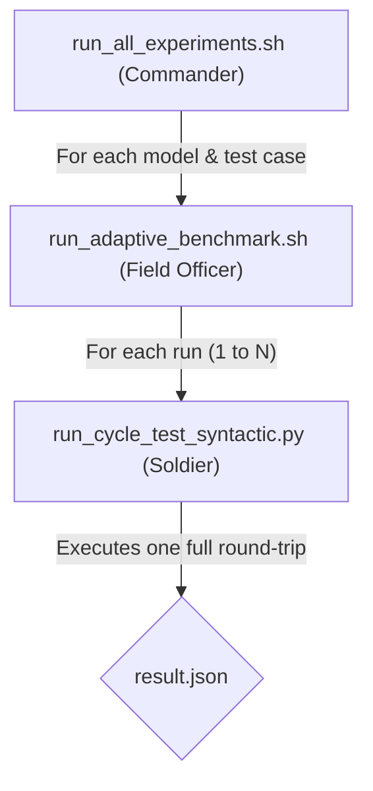
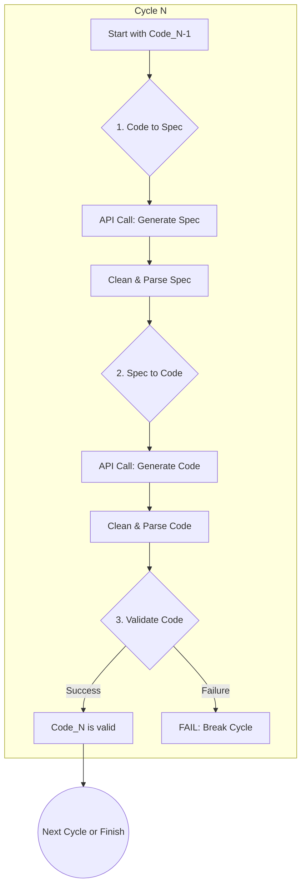
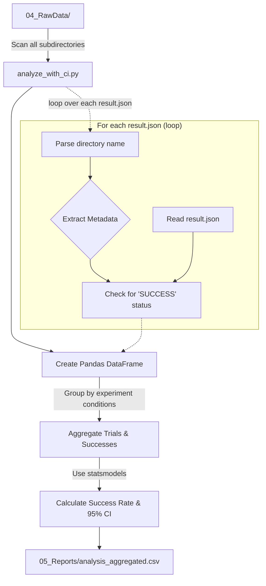

# Semantic Round-trip: Experiment Documentation

## 1. Introduction

This document provides a detailed explanation of the experimental methodology, scripts, data structure, and complete results for the "Semantic Round-trip" benchmark. The goal is to ensure full transparency and enable straightforward replication of this research by other scientists.

## 2. Experiment Scripts Explained

The execution of the benchmark is managed by a hierarchy of scripts located in the `03_Scripts/` directory. This layered approach allows for both broad, automated experiment campaigns and fine-grained, specific tests.

### 2.1. Overall Execution Flow

The primary experimental run is orchestrated by three main scripts, each with a distinct role, creating a clear "Commander -> Field Officer -> Soldier" hierarchy.

### 2.2. Core Algorithm: The Semantic Round-trip Cycle

The core of the benchmark is the `run_cycle` function within `run_cycle_test_syntactic.py`. It performs an iterative "Code-to-Specification-to-Code" loop. The process for each cycle is visualized below.

*Note: The validation of the specification against a ground truth is intentionally bypassed to focus on the functional correctness of the final generated code.*

### 2.3. Role of Each Script

The following table details the purpose and function of each script in the `03_Scripts/` directory.

| Script | Role | Description |
| :--- | :--- | :--- |
| `run_all_experiments.sh` | **Commander** | The main entry point for reproducing the paper's key findings. It orchestrates runs for multiple models across the `fizzbuzz` (known) and `separate_vowels_and_consonants` (novel) test cases. |
| `run_adaptive_benchmark.sh` | **Field Officer** | Manages the execution strategy for a batch of runs. It applies "adaptive" logic (e.g., using Japanese prompts for Gemma models) and a "composite" evaluation mode (strict fallback to forgiving). It calls the core Python script for each individual run. |
| `run_cycle_test_syntactic.py` | **Soldier** | The core execution engine. It performs a single semantic round-trip test for a given model and configuration, calling the Ollama API, parsing the output, validating the code, and logging the detailed results to `result.json`. |
| `run_fizzbuzz_benchmark.sh` | **Specialist** | A script focused solely on the `fizzbuzz` task, iterating through all languages, specification types, and prompt styles. Used for deep dives into performance on this specific task. |
| `run_benchmark.sh` | **Specialist** | A comprehensive script for the `get_magic_number` task. **Warning:** Its output format is currently inconsistent with the main analysis script (`analyze_with_ci.py`). |
| `run_llama3_8b_tests.sh` | **Specialist** | A dedicated script for running tests specifically on the `llama3-8b` model. |

## 3. Data Structure and Aggregation

The results of the experiments are systematically stored and analyzed to ensure traceability and reproducibility.

### 3.1. Raw Data Structure (`04_RawData/`)

Each experimental run, initiated by scripts like `run_adaptive_benchmark.sh`, creates a new timestamped directory in `04_RawData/`.

-   **Parent Directory**: Represents a batch of runs (e.g., `adaptive_composite_n30_separate_vowels_and_consonants_20260101_160101/`). The name encodes the mode, number of runs, test case, and timestamp.
-   **Subdirectory**: Represents a single trial (a full N-cycle test). The name encodes the model, language, spec type, prompt style, test case, and run number (e.g., `falcon3-3b_en_pseudocode_hyper_guided_separate_vowels_and_consonants_run1/`).
-   **`result.json`**: The file inside each subdirectory containing the detailed log of a single trial. It includes:
    -   `status`: The final outcome ("SUCCESS" or "FAIL").
    -   `cycles_completed`: The number of successful cycles before failure (or all cycles if successful).
    -   `logs`: A detailed, cycle-by-cycle log of prompts, raw model outputs, cleaned outputs, and validation results.

### 3.2. Data Aggregation Process (`analyze_with_ci.py`)

The `analyze_with_ci.py` script aggregates the thousands of individual `result.json` files into a comprehensive summary. This process is crucial for deriving the statistical insights presented in the paper.

## 4. Complete Experiment Results Summary
This table provides a comprehensive summary of all aggregated experiment results, generated from `05_Reports/analysis_aggregated.csv`.

| Model | Test Case | Test Type | Trials | Successes | Success Rate (95% CI) |
| :--- | :--- | :--- | :--- | :--- | :--- |
| deepscaler-1.5b | get_magic_number | forgiving | 36 | 0 | 0.0% (95% CI: 0.0-9.6) |
| deepscaler-1.5b | get_magic_number | strict | 36 | 0 | 0.0% (95% CI: 0.0-9.6) |
| deepseek-r1-1.5b | get_magic_number | forgiving | 36 | 0 | 0.0% (95% CI: 0.0-9.6) |
| deepseek-r1-1.5b | get_magic_number | strict | 36 | 0 | 0.0% (95% CI: 0.0-9.6) |
| falcon3-1b | get_magic_number | forgiving | 36 | 0 | 0.0% (95% CI: 0.0-9.6) |
| falcon3-1b | get_magic_number | strict | 36 | 0 | 0.0% (95% CI: 0.0-9.6) |
| falcon3-3b | fizzbuzz | forgiving | 360 | 224 | 62.2% (95% CI: 57.1-67.1) |
| falcon3-3b | fizzbuzz | strict | 360 | 220 | 61.1% (95% CI: 56.0-66.0) |
| falcon3-3b | get_magic_number | forgiving | 36 | 17 | 47.2% (95% CI: 32.0-63.0) |
| falcon3-3b | get_magic_number | strict | 36 | 19 | 52.8% (95% CI: 37.0-68.0) |
| falcon3-3b | get_magic_number | forgiving | 360 | 184 | 51.1% (95% CI: 46.0-56.2) |
| falcon3-3b | get_magic_number | strict | 360 | 195 | 54.2% (95% CI: 49.0-59.2) |
| falcon3-3b | separate_vowels_and_consonants | composite | 30 | 0 | 0.0% (95% CI: 0.0-11.4) |
| gemma-2b | get_magic_number | forgiving | 36 | 0 | 0.0% (95% CI: 0.0-9.6) |
| gemma-2b | get_magic_number | strict | 36 | 0 | 0.0% (95% CI: 0.0-9.6) |
| gemma3-270m | get_magic_number | forgiving | 36 | 0 | 0.0% (95% CI: 0.0-9.6) |
| gemma3-270m | get_magic_number | strict | 36 | 2 | 5.6% (95% CI: 1.5-18.1) |
| gemma3-4b | fizzbuzz | forgiving | 360 | 315 | 87.5% (95% CI: 83.7-90.5) |
| gemma3-4b | fizzbuzz | strict | 360 | 302 | 83.9% (95% CI: 79.7-87.3) |
| gemma3-4b | get_magic_number | forgiving | 36 | 18 | 50.0% (95% CI: 34.5-65.5) |
| gemma3-4b | get_magic_number | strict | 36 | 22 | 61.1% (95% CI: 44.9-75.2) |
| gemma3-4b | get_magic_number | forgiving | 360 | 197 | 54.7% (95% CI: 49.6-59.8) |
| gemma3-4b | get_magic_number | strict | 360 | 204 | 56.7% (95% CI: 51.5-61.7) |
| gemma3-4b | separate_vowels_and_consonants | composite | 30 | 15 | 50.0% (95% CI: 33.2-66.8) |
| llama2-7b | get_magic_number | forgiving | 36 | 7 | 19.4% (95% CI: 9.8-35.0) |
| llama2-7b | get_magic_number | strict | 36 | 0 | 0.0% (95% CI: 0.0-9.6) |
| llama2-7b | get_magic_number | forgiving | 360 | 75 | 20.8% (95% CI: 17.0-25.3) |
| llama2-7b | get_magic_number | strict | 360 | 73 | 20.3% (95% CI: 16.4-24.7) |
| llama3.2-1b | get_magic_number | forgiving | 36 | 0 | 0.0% (95% CI: 0.0-9.6) |
| llama3.2-1b | get_magic_number | strict | 36 | 0 | 0.0% (95% CI: 0.0-9.6) |
| llama3.2-3b | fizzbuzz | forgiving | 360 | 43 | 11.9% (95% CI: 9.0-15.7) |
| llama3.2-3b | fizzbuzz | strict | 360 | 44 | 12.2% (95% CI: 9.2-16.0) |
| llama3.2-3b | get_magic_number | forgiving | 36 | 10 | 27.8% (95% CI: 15.8-44.0) |
| llama3.2-3b | get_magic_number | strict | 36 | 12 | 33.3% (95% CI: 20.2-49.7) |
| llama3.2-3b | get_magic_number | forgiving | 360 | 118 | 32.8% (95% CI: 28.1-37.8) |
| llama3.2-3b | get_magic_number | strict | 360 | 112 | 31.1% (95% CI: 26.5-36.1) |
| llama3.2-3b | separate_vowels_and_consonants | composite | 30 | 0 | 0.0% (95% CI: 0.0-11.4) |
| orca-mini-3b | get_magic_number | forgiving | 36 | 0 | 0.0% (95% CI: 0.0-9.6) |
| orca-mini-3b | get_magic_number | strict | 36 | 0 | 0.0% (95% CI: 0.0-9.6) |
| phi-latest | get_magic_number | forgiving | 36 | 0 | 0.0% (95% CI: 0.0-9.6) |
| phi-latest | get_magic_number | strict | 36 | 0 | 0.0% (95% CI: 0.0-9.6) |
| phi3-mini | get_magic_number | forgiving | 36 | 2 | 5.6% (95% CI: 1.5-18.1) |
| phi3-mini | get_magic_number | strict | 36 | 2 | 5.6% (95% CI: 1.5-18.1) |
| phi3-mini | get_magic_number | forgiving | 360 | 33 | 9.2% (95% CI: 6.6-12.6) |
| phi3-mini | get_magic_number | strict | 360 | 38 | 10.6% (95% CI: 7.8-14.2) |
| qwen-0.5b | get_magic_number | forgiving | 36 | 0 | 0.0% (95% CI: 0.0-9.6) |
| qwen-0.5b | get_magic_number | strict | 36 | 0 | 0.0% (95% CI: 0.0-9.6) |
| qwen-1.8b | get_magic_number | forgiving | 36 | 0 | 0.0% (95% CI: 0.0-9.6) |
| qwen-1.8b | get_magic_number | strict | 36 | 0 | 0.0% (95% CI: 0.0-9.6) |
| qwen-4b | get_magic_number | forgiving | 36 | 0 | 0.0% (95% CI: 0.0-9.6) |
| qwen-4b | get_magic_number | strict | 36 | 0 | 0.0% (95% CI: 0.0-9.6) |
| qwen2-1.5b | get_magic_number | forgiving | 36 | 0 | 0.0% (95% CI: 0.0-9.6) |
| qwen2-1.5b | get_magic_number | strict | 36 | 1 | 2.8% (95% CI: 0.5-14.2) |
| qwen2.5-0.5b | get_magic_number | forgiving | 36 | 0 | 0.0% (95% CI: 0.0-9.6) |
| qwen2.5-0.5b | get_magic_number | strict | 36 | 1 | 2.8% (95% CI: 0.5-14.2) |
| qwen3-0.6b | get_magic_number | forgiving | 36 | 0 | 0.0% (95% CI: 0.0-9.6) |
| qwen3-0.6b | get_magic_number | strict | 36 | 0 | 0.0% (95% CI: 0.0-9.6) |
| smollm-360m | get_magic_number | forgiving | 36 | 0 | 0.0% (95% CI: 0.0-9.6) |
| smollm-360m | get_magic_number | strict | 36 | 0 | 0.0% (95% CI: 0.0-9.6) |
| smollm2-1.7b | get_magic_number | forgiving | 36 | 0 | 0.0% (95% CI: 0.0-9.6) |
| smollm2-1.7b | get_magic_number | strict | 36 | 0 | 0.0% (95% CI: 0.0-9.6) |
| stablelm2-1.6b | get_magic_number | forgiving | 36 | 0 | 0.0% (95% CI: 0.0-9.6) |
| stablelm2-1.6b | get_magic_number | strict | 36 | 0 | 0.0% (95% CI: 0.0-9.6) |
| tinyllama-1.1b | get_magic_number | forgiving | 36 | 0 | 0.0% (95% CI: 0.0-9.6) |
| tinyllama-1.1b | get_magic_number | strict | 36 | 0 | 0.0% (95% CI: 0.0-9.6) |
| yi-6b | get_magic_number | forgiving | 36 | 2 | 5.6% (95% CI: 1.5-18.1) |
| yi-6b | get_magic_number | strict | 36 | 3 | 8.3% (95% CI: 2.9-21.8) |
| yi-6b | get_magic_number | forgiving | 360 | 33 | 9.2% (95% CI: 6.6-12.6) |
| yi-6b | get_magic_number | strict | 360 | 31 | 8.6% (95% CI: 6.1-12.0) |
